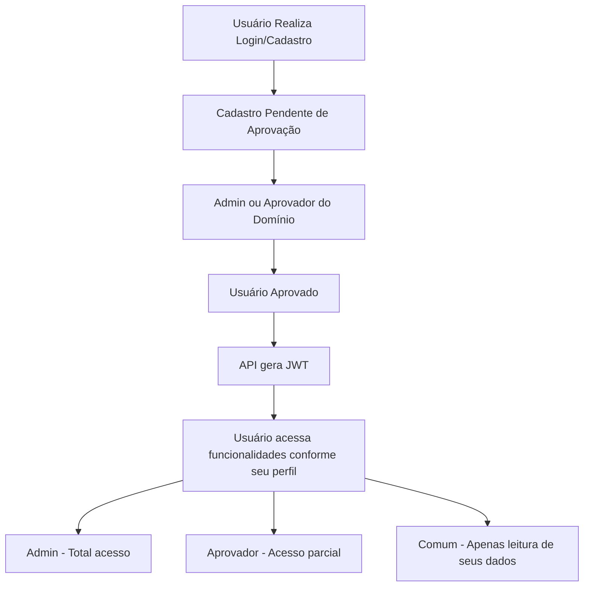

# 🛡️ API_J.A – Sistema de Controle de Acesso

Este projeto tem como objetivo fornecer uma API RESTful robusta para gerenciamento de acessos com autenticação baseada em JWT. Desenvolvido com tecnologias modernas, o sistema oferece segurança, escalabilidade e integração entre backend .NET e frontend React com Vite.

---

## 🚀 Tecnologias Utilizadas

### 🔧 Backend (.NET)

- **ASP.NET Core 9.0**
- **Entity Framework Core** (SQL Server)
- **JWT (JSON Web Token)** – Autenticação segura com tokens
- **Swagger UI** – Documentação interativa da API
- **CORS Configurado** para integração segura com o frontend

### 🎨 Frontend (React + Vite)

- **React**
- **Vite** – Ambiente de desenvolvimento rápido com HMR
- **TailwindCSS** + PostCSS + Autoprefixer – Estilização moderna
- **React Router DOM** – Navegação entre rotas
- **ESLint configurado** com possibilidade de expansão para TypeScript

---

## 👥 Tipos de Usuários e Permissões

| Tipo de Usuário | Permissões |
|-----------------|------------|
| **Admin**       | - Gerencia usuários de **todos os domínios**<br> - Aprova usuários de **múltiplos domínios**<br> - Pode fazer download de JSON contendo **todos os usuários** |
| **Aprovador**   | - Aprova usuários **somente do seu domínio**<br> - Pode fazer download de JSON com usuários apenas do seu domínio |
| **Comum**       | - Pode apenas **visualizar seus próprios dados** |

---

## ⚙️ Como Executar o Projeto

### Pré-requisitos

- [.NET SDK 9.0+](https://dotnet.microsoft.com/)
- [Node.js 18+](https://nodejs.org/)
- [SQL Server](https://www.microsoft.com/pt-br/sql-server/sql-server-downloads)

### 🔙 Backend

```bash
cd API_J.A-main/ControleAcessoApi
dotnet restore
dotnet build
dotnet run
```

### 🎨 Frontend

```bash
npm install
npm run dev
```

---

## 🔐 Autenticação JWT

A API utiliza JWT com os parâmetros `Issuer`, `Audience` e `Key`, configuráveis via `appsettings.json` ou variáveis de ambiente.

Após autenticação bem-sucedida, o token deve ser enviado no cabeçalho das requisições protegidas da seguinte forma:

```http
Authorization: Bearer {token}
```

---

## 🧾 Cadastro de Usuário

Na tela de login do sistema, também é possível realizar o **cadastro de um novo usuário**. Após o envio das informações, o novo cadastro ficará **pendente de aprovação** por um **Admin** ou **Aprovador**, conforme o domínio do solicitante.

---

## 🧪 Documentação Swagger

Uma vez que o backend estiver rodando, acesse a documentação interativa da API em:

```
https://localhost:5000/swagger
```

---

## 🧰 Template do Frontend com React + Vite

Este frontend usa a base de Vite com configuração mínima:

- Suporte a **Fast Refresh** com `@vitejs/plugin-react` ou `@vitejs/plugin-react-swc`
- ESLint configurado (recomendado expandir com regras TypeScript para projetos maiores)
- Estilização responsiva com **TailwindCSS**

---

## 🧭 Diagrama de Funcionamento



---

## 📝 Licença

Este projeto está licenciado sob os termos da **ISC License**.

---

## ✍️ Autor

Projeto desenvolvido como parte da **Jornada de Aprendizagem FIEP/KNAPP – 2025**.
